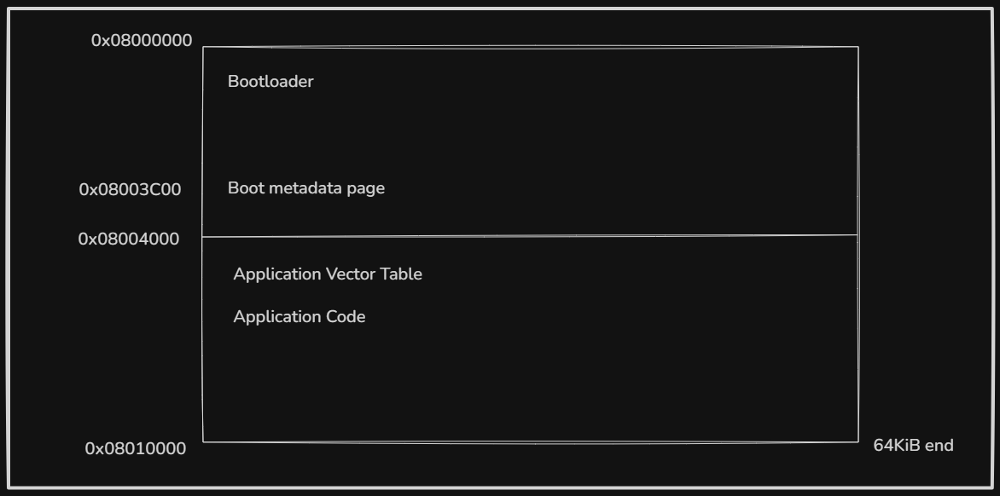
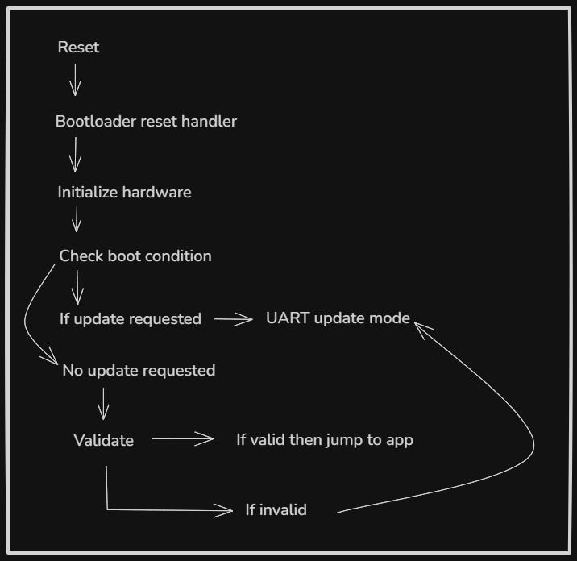

# Kestrel Bootloader Specification

## 1. Target hardware

| Item | Value |
| --- | --- |
| MCU | STM32F103C8T6 / STM32F103 Blue Pill |
| Core | ARM Cortex-M3 |
| Flash base | `0x08000000` |
| SRAM base | `0x20000000` |
| Bootloader base | `0x08000000` |
| Application base | `0x08004000` |
| Initial app limit | assume 64 KiB total flash (unless later adjusted) |

> We assume 64KiB flash but some boards may have 128KiB.

## 2. Flash layout

Constants:

- `BOOT_FLASH_BASE = 0x08000000`
- `BOOT_APP_BASE = 0x08004000`
- `BOOT_METADATA_ADDR = 0x08003C00`
- `BOOT_FLASH_PAGE_SIZE = 1024`

The boot metadata page stores the installed app size, hash, signature, version, and validity marker.

## 3. Security model

The bootloader trusts:

- Its own flash region.
- A compiled-in public key.
- The boot metadata page only after checks.

The bootloader does not trust:

- Bytes in the application region until verified.
- Firmware received over UART.
- Metadata with invalid magic, invalid length, invalid version, or failed signature.

## 4. Boot flow

## 5. Boot condition

The bootloader enters update mode if any of these are true:

- A hardware/user boot condition is active.
- Installed app metadata is missing or invalid.
- Installed app signature verification fails.
- Application vector table sanity checks fail.

A simple first boot condition can be one GPIO pin held in a known state during reset.

## 6. Firmware update protocol

It's rather simple one for now, intended to be improved over time.

| Packet | Purpose |
| --- | --- |
| `HELLO` | Host asks whether bootloader is alive |
| `BEGIN` | Provides firmware size, version, and signature |
| `DATA` | Sends a chunk of firmware bytes |
| `END` | Finalizes write and requests verification |
| `ABORT` | Cancels update |

1. Host sends `HELLO`.
2. Host sends `BEGIN` with app size, version, and signature.
3. Bootloader erases the app flash range.
4. Host sends `DATA` packets in order.
5. Bootloader writes chunks to flash and updates SHA-256 state.
6. Host sends `END`.
7. Bootloader verifies the final hash/signature.
8. If valid, bootloader writes metadata and resets.
9. If invalid, bootloader rejects the image and stays in update mode.

## 7. Application validation

Before booting the app, the bootloader checks:

- Is metadata magic is correct?
- Is metadata size within application flash range?
- Is metadata version acceptable?
- Does the initial stack pointer point into SRAM?
- Does the reset handler point into application flash?
- Does the SHA-256 hash of application bytes match metadata?
- Does the ECDSA signature verify against the compiled-in public key?

Only after all checks pass may the bootloader jump to the app.

